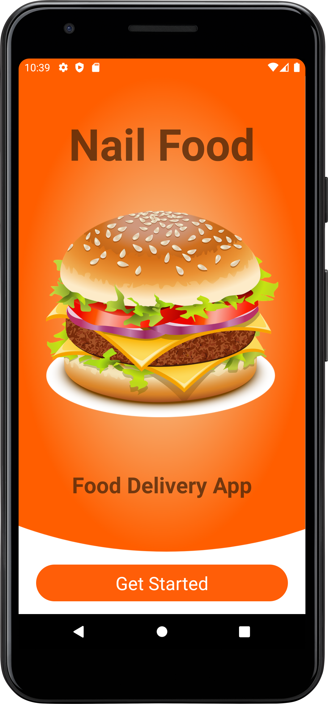
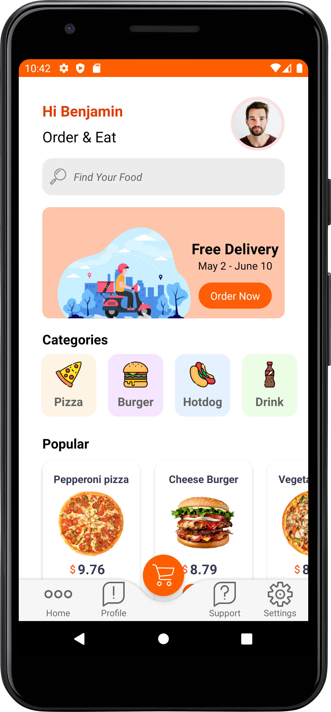
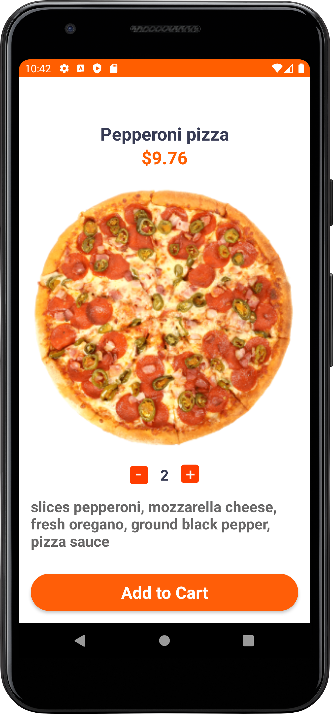
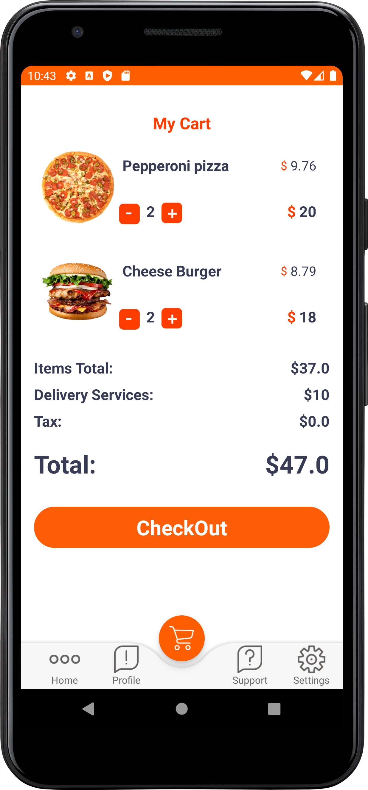

## Nail Food Android App in Kotlin

This application was written according to a YouTube tutorial from the [UiLover Android](https://www.youtube.com/c/UiLoverAndroid) channel:

[✅ Food App Android Design - how to make food ordering app](https://www.youtube.com/watch?v=9nWcPPHBzMk&t=8212s)

The difference from the tutorial is that most of the files (except TinyDB) are written in Kotlin, not Java.  
There are also differences in the Gradle build settings and several minor parameters, as the application was   
tested on a higher version of Android (API 30, Android 11, R)

#### Activities Preview

Intro Activity         |        Main Activity      |       Detail Activity     |        Cart Activity
:-------------------------:|:-------------------------:|:-------------------------:|:-------------------------:
  |   |   |  

<!--  -->
